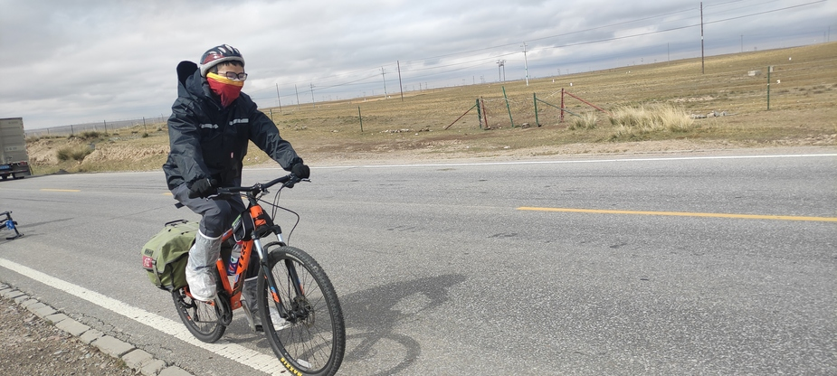
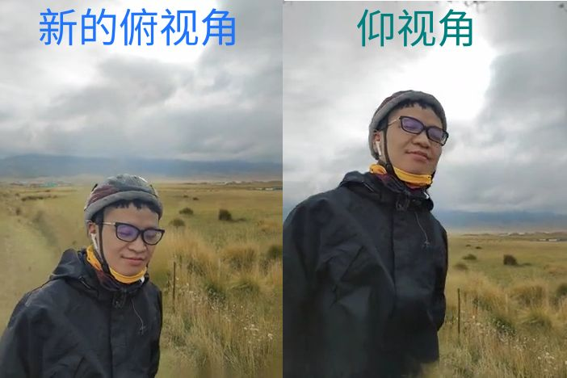

<!-- Others

https://github.com/avaer/ml-sharp-example?tab=readme-ov-file (一个人跑的 ply 文件，可以直接合成图片的！)

--->

Hello，各位读者和听众朋友们，欢迎来到 FS IT's English Channel，这是我们的第一期内容。

今天我们来看下苹果团队最近开源的一个工作： [SHARP](https://apple.github.io/ml-sharp/) (Single-image High-Accuracy Real-time Parallax)，是 CV (计算机视觉) 领域 Monocular View Synthesis (单目视图合成)方向，宣称只要 1 张照片，就可以在 A100 机器上 1s 渲染出新视角。

听起来很有意思啊，就让我们一起来读读摘要和评论，看看这篇工作成色如何吧。

## Abstract Part

OK，正式看摘要部分前，先学习下 SHARP 里 P 对应的单词 Parallax：

<section class="kp">
  <span class="dot"></span>
Parallax
</section>

是“视差”的意思，就是说当相机发生小幅移动时，画面中不同深度的物体会产生正确的相对位移（近处的位移大，远处的小）。这个词在 CV 里用得比较多。看看下面的例句吧：

> <span class="hdot"></span> Parallax 例句
>
> - When you look out of a moving train, nearby objects rush past, while distant mountains barely move. That’s parallax.  
> - High-quality parallax is what makes a scene feel truly 3D.
> - Single-image parallax remains a challenging problem.

好，明白了 Parallax，我们正式进入 Abstract 部分吧。

<section class="st">
<section class="src-tag">“ Source Text</section>
We present SHARP, an approach to photorealistic view synthesis from a single image. Given a single photograph, SHARP regresses the parameters of a 3D Gaussian representation of the depicted scene. This is done in less than a second on a standard GPU via a single feedforward pass through a neural network. 
</section>

非常精炼的表述啊，先来看看这里面几个重点单词吧：

<section class="kp">
  <span class="dot"></span>
present
</section>
 
表示正式地提出、介绍、公布（研究成果、方法、模型）；在论文开头非常常见的单词，类似单词的还有 propose, introduce. 下面的例句，背熟它们肯定有用：

> <span class="hdot"></span> Present 例句
> 
> - We present a novel framework for real-time rendering.
> - This paper presents a new benchmark for image segmentation.
> - We present experimental results demonstrating the effectiveness of our method.

<section class="kp">
  <span class="dot"></span>
photorealistic
</section>

CV 里极其常见的单词，形容生成的图片/视频效果极其逼真——照片级别的真实，容易看出它是 photo + realistic 两个单词合成的，记忆起来是不是更简单了。类似单词有 high-fidelity, 但二者并不不等价。
看下下面的例句:

> <span class="hdot"></span> photorealistic/high-fidelity 例句
> 
> - Our method produces photorealistic images under complex lighting conditions.
> - The model achieves photorealistic view synthesis from a single input image.
> - Our method generates high-fidelity 3D reconstructions with accurate geometry and textures.
> - The system supports high-fidelity audio playback with minimal distortion.

<section class="kp">
  <span class="dot"></span>
regress
</section>

很精确的一个单词，表示通过模型直接预测（连续值）参数——也就是对应 linear-regression 里的意思。一个单词就精确表达了模型的特点。看下类似的用法：

> <span class="hdot"></span> regress 例句
>
> - The network regresses camera poses from monocular images.
> - We train the model to regress depth maps directly.

<section class="kp">
  <span class="dot"></span>
depicted
</section>

表示“（图像）呈现/描绘出的”，可以用 shown 来替代，但 depicted 更正式，且 depicted scene 在正式文本里也算是固定搭配了。看下相关的例句：

> <span class="hdot"></span> depicted 例句
>
> - The model reconstructs the geometry of the depicted scene.
> - The depicted scene may differ from actual gameplay. (游戏宣传里常见)
> - The depicted scene represents a traditional family dinner. (博物馆中常见)


最后看下这几个介词：

- an approach **to** photorealistic view synthesis

  an approach 后面用 **to** 是强搭配 (strong collocation).

- This is done **in** less than a second **on** a standard GPU **via** a single feedforward pass **through** a neural network.
  
  这句话堆叠了 4 个介词，清晰明确的说明了方法的 perf. 很漂亮，但是也会显得“堆叠”，可以改写成下面的 2 个子句，读起来没那么喘：

  This process completes in under one second on a standard GPU, requiring only a single feedforward pass through a neural network.

<section class="st">
<section class="src-tag">“ Source Text</section>
The 3D Gaussian representation produced by SHARP can then be rendered in real time, yielding high-resolution photorealistic images for nearby views. The representation is metric, with absolute scale, supporting metric camera movements. 
</section>

这里解释 2 个偏专业领域的词：

<section class="kp">
  <span class="dot"></span>
nearby views
</section>

在计算机视觉里通常指“小视差范围内的新视角”，或者说“同一场景的相邻视角”，其与原视角接近，只有小幅度 viewpoint change. 这解释了 demo 里为啥新视角的结果看起来和原图差别不大。

<section class="kp">
  <span class="dot"></span>
metric
</section>

这里指“具有真实尺度的”，也就是能够对应到真实世界里的具体距离的。这在单目视图合成是比较关键的特性——一般来说，单目（一个眼睛）视图是确定不了具体距离的，只有一个相对的感受。但这里可以确定物体的具体距离（深度），这就让该方法的应用范围可以扩展到 AR 等场景。

<section class="st">
<section class="src-tag">“ Source Text</section>
Experimental results demonstrate that SHARP delivers robust zero-shot generalization across datasets. It sets a new state of the art on multiple datasets, reducing LPIPS by 25–34% and DISTS by 21–43% versus the best prior model, while lowering the synthesis time by three orders of magnitude.
</section>

重点看一个单词

<section class="kp">
  <span class="dot"></span>
deliver
</section>

用得非常漂亮的词，表示“成功实现/提供（预期的效果）”，这里可以换用 achieves, provides 或者 shows，但感觉都没有 delivers 读来舒服。除了这个“实现/提供”的含义，deliver 本身还常用于快递、送达场景。来看看相关例句吧：

> <span class="hdot"></span> deliver 例句
> 
> The update delivers a better user experience.
> The package was delivered this morning.
> They deliver food within 30 minutes.
> The courier will deliver the documents tomorrow. (courier 快递员、快递公司、导游)

再简单说下里面涉及的领域知识：

- LPIPS(Learned Perceptual Image Patch Similarity), DISTS(Deep Image Structure and Texture Similarity) 都是衡量图像质量的指标；值越低越好。
- three orders of magnitude = 1000 倍；order of magnitude 是“数量级”的意思。

## Comments part

好啦，读完论文的 abstract, 是不是有点不明觉厉？咱们来看看 Hacker News 上大家怎么看的吧。

首先是第一条评论

<section class="st">
<section class="src-tag">“ Source Text</section>
"Unsplash > Gen3C > The fly video" is nightmare fuel. View at your own risk: [fly video](https://apple.github.io/ml-sharp/video_selections/Unsplash/gen3c_aligned/-6ebJNtXtWs_0000-0001.mp4)
</section>

看是典型的水评论，不过还是有 2 个短语值得学习：

<section class="kp">
  <span class="dot"></span>
nightmare fuel
</section>

可以理解成“噩梦制造机”，或者意译“令人不适”。

nightmare 是“噩梦”的意思，在评论里巨常见的词，老外很喜欢用这个。

fuel: 不可数名词；本意是“燃料”的意思，这个场景里隐喻“情绪 / 反应的放大器”，常见于下面的口语句式：

> <span class="hdot"></span> fuel 表示情绪/反应放大器的常见句式
> 
> X is (pure / absolute)  [emotion / reaction] fuel.

看下面的例句更直观些：

> <span class="hdot"></span> fuel 例句
>
> - This design decision is anxiety fuel.
> - This policy is rage fuel on social media.
> - Lack of transparency is conspiracy fuel.
> - Poor error messages are support-ticket fuel.

<section class="kp">
  <span class="dot"></span>
at your own risk
</section>

免责声明，“后果自负”的意思。在多伦多的公园里，基本都有块牌子，上面写着“No winter maintenance, Use at your own risk” :)

> <span class="hdot"></span> at your own risk 例句
>
> - Enter the construction site at your own risk. 
>   进入工地请自行承担风险。
> - Use this software at your own risk. (这个更熟悉吧 :)

----

看第二条评论：

<section class="st">
<section class="src-tag">“ Source Text</section>
Can someone ELI5 what this does? I read the abstract and tried to find differences in the provided examples, but I don't understand (and don't see) what the "photorealistic" part is.
</section>

又来一个非常常见的互联网缩写

<section class="kp">
  <span class="dot"></span>
ELI5
</section>

= Explain Like I’m 5, “请用用最简单、直白的方式解释”；虽然这个词常用在论坛的字面交流里，但如果一定要读的话，可以有几种常见的读法：

1. E-LI five, “怡莱 five” (我看 Youtube 上有人这么读)
2. E-L-I five. 按字母逐个读 (ChatGPT 推荐)
3. Explain like i am five, 扩展读

看看下面的例句，下次就可以用上了：

> <span class="hdot"></span> ELI5 例句
>
> - ELI5 how this works.
> - ELI5 the difference between A and B.
> - ELI5 what Kubernetes actually does.
> - ELI5 why this is better than previous SOTA.

---

好了，最后看这条评论

<section class="st">
<section class="src-tag">“ Source Text</section>
This is a terrible presentation. The paper abstract is bordering on word salad, the demo images are meaningless and don’t show any clear difference to the previous SotA, the introduction talks about "nearby" views while the images appear to show zooming in, etc.
</section>

犀利吧，咱们看 2 个短语：


<section class="kp">
  <span class="dot"></span>
bordering on
</section>

这是一个非常好用的书面 + 评论词，意思是“踩在边缘/几乎算是”。也可以直接用 borders on, 看下面的一些例句：

> <span class="hdot"></span> borders on 例句
>
> - Her behavior borders on rude.
> - The company's practices border on illegal. 
    公司的做法几乎违法。


<section class="kp">
  <span class="dot"></span>
word salad
</section>

很有意思的词语，直译“词语沙拉”，常用来形容论文、演讲或写作里语言堆砌、概念乱七八糟的现象。最开始这个词是心理学里用来描述精神疾病患者说话混乱的状态，后来在网络上被广泛借用。
看下面的一些例句：

> <span class="hdot"></span> word salad 例句
>
> he abstract is so dense, it’s practically a word salad.  
  这篇摘要太难懂，几乎成了文字沙拉。
> His explanation was just a word salad, I couldn’t follow.  
  他的解释乱七八糟，我根本听不懂。

## ELI5 & 人像实图测试

好啦，英语从这个点云里我们可以明白——解释部分就完了。回到这篇论文 SHARP，它究竟是个啥，有啥意义？我也没看全文，借助 ChatGPT，简单描述下：

- 一句话解释：输入 1 张照片，SHARP 网络跑一次就可以还原出它对应的 3D 世界，然后你就可以在这个 3D 世界里去调整视角，再渲染出新的照片。
- 一种可能的应用场景：想象一下在外面拍完照回去，发现照片把人拍矮了；没事，用这个还原照片当时的 3D 场景，再调低镜头，重新渲一张仰拍图

真的有这么好用不？[代码+模型](https://github.com/apple/ml-sharp) 已经开源了，我们可以来试试。

根据我一点点的经验，在代码运行前我先把模型下下来，然而没想到啊，苹果就是苹果，在国内原地址（CDN）下载模型都能到 ~30MB/s, 是我多虑了。

一切妥当，我精心挑选了 2 张年轻时骑青海湖的照片，这就跑起来吧：

*PS: 选择人像是因为评论提及这个比较难，而且论文示例里没有这类；同时为规避版权问题选择自拍图。*

```bash
# Nvidia 3060
# PS: 千万别用 `-v` verbose 模式，不然满屏 \c 符号，直接把我电脑弄死机了
sharp predict -i data/test-human-input/ -o output/test-human -c model-download/sharp_2572gikvuh.pt --device cuda

# 2025-12-18 00:03:26,294 | INFO | Processing 2 valid image files.
# 2025-12-18 00:03:26,294 | INFO | Using device cuda
# 2025-12-18 00:03:26,294 | INFO | Loading checkpoint from model-download/sharp_2572gikvuh.pt
# 2025-12-18 00:03:28,195 | INFO | Using preset ViT dinov2l16_384.
# 2025-12-18 00:03:30,682 | INFO | Using preset ViT dinov2l16_384.
# 2025-12-18 00:03:34,875 | INFO | Processing data/test-human-input/big-face.jpg
# 2025-12-18 00:03:35,023 | INFO | Running preprocessing.
# 2025-12-18 00:03:35,114 | INFO | Running inference.
# 2025-12-18 00:03:39,046 | INFO | Running postprocessing.
# 2025-12-18 00:03:41,349 | WARNING | Received 1 reflection matrices from SVD. Flipping them to rotations.
# 2025-12-18 00:03:41,777 | INFO | Saving 3DGS to output/test-human
# ... omitted the log for another photo
# Total took 30s (run with pre-downloaded model)

sharp render -i output/test-human -o output/test-human-renderings
# 2025-12-18 10:53:44,419 | INFO | Rendering output/test-human/small-face.ply
# W1218 10:53:45.065000 55284 torch/utils/cpp_extension.py:2425] TORCH_CUDA_ARCH_LIST is not set, all archs for visible cards are included for compilation. 
# W1218 10:53:45.065000 55284 torch/utils/cpp_extension.py:2425] If this is not desired, please set os.environ['TORCH_CUDA_ARCH_LIST'] to specific architectures.
# ... omitted the log for another photo
# Total took 42s (second run, because it will compile cpp extension on the first run)
```

来看看效果：

- **原图1：小脸（原始分辨率 4624x2080, 这里有压缩，下同）**

  

  渲染效果（直出分辨率 4624x2080）：
  
  <video controls width="100%" preload="metadata">
    <source src="small-face.compressed.mp4" type="video/mp4">
    Your browser does not support the video tag.
  </video>
  
  别说，还可以啊！再来看看模型直出的 Gaussians Splatting 的结果（就是前面说的 3D 世界），我用的这个 [web 工具](https://enter-tainer.github.io/browser-sharp/).
  
  <video controls width="100%" preload="metadata">
    <source src="small-face-gaussians.compressed.mp4" type="video/mp4">
    Your browser does not support the video tag.
  </video>
  
  我们可以看到：视角一旦大幅超过原图的角度，就没有对应的点云了，也即 unobserved regions.

  这就解释了为什么文章说只能渲染出 near view 了：因为视差太大的角度，从单张图片里根本无法准确还原。
  要做到渲染出当前图片不存在的信息，可能超出了本文研究者的预期——不是不行，就是得重新设计数据、网络架构和训练方法了。
  市面上现有的图像、视频生成模型也是可做到这点的，不过实现路径上和这个估计不太一样。

- **原图2：大脸（原始分辨率 4624x3472）**

  

  我们换一个渲染角度，让它稍微大一点，渲染效果（直出分辨率 1744x2320）如下：
  
  <video controls width="100%" preload="metadata">
    <source src="big-face.compressed.mp4" type="video/mp4">
    Your browser does not support the video tag.
  </video>

  调出其中的两个视角：

  

  哈哈，基本勉强实现了前面说到的效果吧。可以看到边沿还是有 artifacts 的，应该是这个部分没有点云覆盖。

  Gaussians Splatting 结果

  <video controls width="100%" preload="metadata">
    <source src="big-face-gaussians.compressed.mp4" type="video/mp4">
    Your browser does not support the video tag.
  </video>

  可以看到点云覆盖确实非常有限，基本限定在原图的视角。

好的，实操下来看，我认为在作者设定的预期里，人像的效果还是不错的。作为一个曾经短暂尝试学习 SLAM 失败的人来说，这个单目重建效果还很惊艳了。
那对这个效果，是否达到你的期望呢？

## The End

好啦，本期内容到此结束。喜欢的话就点个收藏，帮助频道慢慢成长吧。

咱们下期再见！